# Reflektion L2 och L3

**Kapitel 2: Meaningful names**

Redan när jag arbetade med L2 så funderade jag i de flesta fall på vad jag kunde använda för passande namn redan när jag programmerade, men vid vissa tillfällen när jag var för fokuserad på att hitta en fungerande kod så blev det ändå att jag slängde in något kort tillfälligt namn som i vissa fall blev kvar. Under arbetet med L3 har jag fortsatt arbetet med att försöka förbättra namngivningen för att bättre tydliggöra vad metoder gör och vad variablerna står för och framförallt har jag ändrat en del namn som användes i flera fall, men där betydelsen varierade. Målet har varit att minska antalet fall där jag bryter mot principerna “Use intention-reveling names”, “Make meaningful distinctions”, “Don´t pun” och “Avoid disinformation”. 

I L2an hade jag nedan metod där det var mycket som var otydligt i namngivningen.   

I min uppdaterade metod har jag ändrat metodnamnen för att tydliggöra att det är feedback från computerklassen som efterfrågas och att det är spelarens svar som kommer in som parameter vilket gör att jag vilket minskar brytandet mot principerna Avoid disinformation och use intention-revealing names. Jag har även skapat en separat metod för updateNumberOfGuesses eftersom det inte var tydligt att checkAnswermetoden även uppdaterade antalet gissningar.   
  

I min modul använder jag items och därför använde jag itembenämningen även i resten av appen, men då spelet heter Hidden Bricks Game så valde jag att börja använda ordet brick istället för att det ska bli tydligare. 
  

**Kapitel 3: Functions**

**Kapitel 4: Comments**

Dokumentarer är väl inte direkt mitt favoritämne, men jag förstår varför det är så viktigt att använda det och framförallt nu i höst när vi börjat med grupparbeten då jag gärna vill förstå mina klasskamraters kod och även vill att de ska förstå min. Att bara skriva kommentarer är lätt, men att skriva bra kommentarer som tillför ny information, inte är missledande, inte är för långa/korta och dessutom är intressanta och relevanta för koden den beskriver är svårt och absolut något jag behöver öva på. Misslyckas man med detta så bryter man bland annat mot principerna “Mumbling, “Redundant/misleading/noisy comments”, “To much information” och “Don't use a comment when you can use a function or a variable”. Jag håller delvis med författaren av Clean Code att det egentligen är bättre med självförklarande kod, men samtidigt förstår jag att kod ändå kan vara svår att förstå och därför behöver kommentarer. Speciellt viktigt är det när man skriver kod som nybörjare ska kunna använda och när det gäller min modul så misstänker jag att eventuella användare kommer att vara nybörjare. 

När jag har gjort om koden i L2 så får jag erkänna att jag många gånger har missat att uppdatera kommentarerna direkt, vilket försvårar mitt arbete nu i efterhand då framförallt flera parametrar och returtyper har ändrats. När jag tittade igenom min gamla L2 så reagerade jag framförallt på nedan kommentarer som liknar varandra alltför mycket och inte beskriver på något bra sätt vad koden gör. 
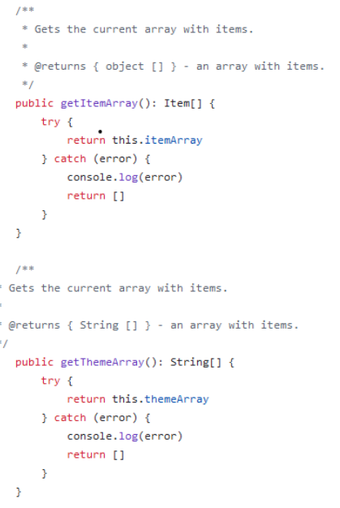 

Nu har jag skrivit om kommentarerna så att de istället ser ut så här för att bättre förklara koden:
 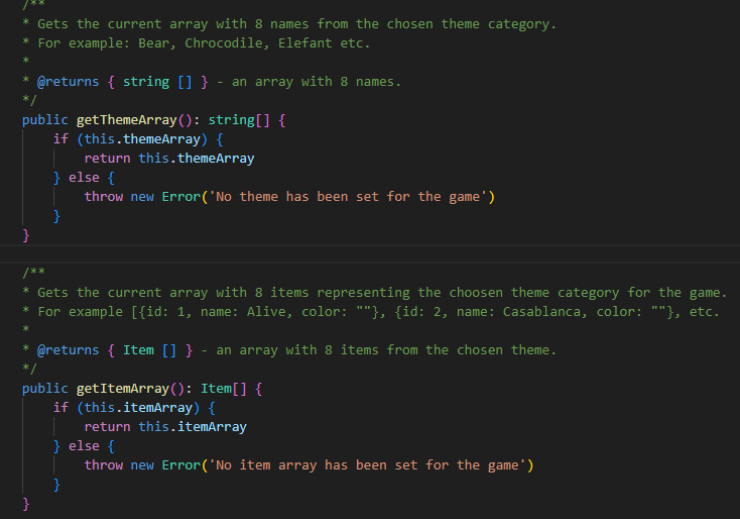 

Nedan exempel från Gameklassen i L3 visar en vanlig typ av kommentar som både jag brukar skriva och som jag hittar i många andras kod också. Den känns som en typisk onödig kommentar eftersom det är tydligt vad det rör sig om när det står “class Game”. Anledningen till att jag skriver den här typen av kommentarer är för att jag inte riktigt vet vad jag bör skriva istället , men jag vet att jag måste skriva en kommentar så då har jag skrivit på samma sätt som några av mina tidigare lärare. 

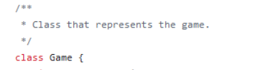  

Här är den omskrivna kommentaren:  
  

**Kapitel 5: Formatting**

**Kapitel 6: Objects and Data Structures**

**Kapitel 7: Error handling**
Felhantering är också ett område som jag behöver öva mer på. Ofta använder jag samma typ av felkoder, undantag och felmeddelanden eftersom jag känner mig osäker på vad som passar bäst i den aktuella situationen. När jag har programmerat i Java så har jag kommit i kontakt med flera typer av Unchecked Exceptions som exempelvis NullPointerException och ArrayIndexOutOfBounds och har lärt mig hantera dessa typer av undantag, men när det gäller Typescript så behöver jag öva mer. 

I boken läste jag även att man bör undvika att returnera null och att det är ännu värre att skicka in null som en parameter. När jag började programmera med Typescript så hade jag många sådana fall i min app, men jag har försökt bygga bort det och har även plockat bort flera parametrar och retursatser av typen “any” för att undvika potentiella fel. När jag returnerar felmeddelanden så har jag försökt tänka på att skicka med tillräckligt med information för att användaren ska förstå vad det är som gått fel vilket följer principen “Provide context with exceptions”

Jag tycker även att det är svårt att veta när jag bör kasta ett undantag och när det passar bättre med ett error.  I Clean code läste jag att try, catch, finally är den bästa varianten av felhantering (enligt “Define exception classes in terms of a caller's needs”), men när jag försökte implementera det så lyckades jag inte få det att fungera tillsammans med Typescript. Jag har googlat en del, men inte hittat någon bra lösning, så min plan är att be ChatGPT visa hur jag ska göra efter att jag har lämnat in L3 så vet jag iallafall hur jag ska göra i fortsättningen. I L3 fick det istället bli vanliga Try - Catch satser, men jag försökte undvika mer än en catch så gott jag kunde eftersom det inte rekommenderas. 

Nedan visar hur min generateRow såg ut när jag lämnade in L2, men efter att ha läst Clean Code insåg jag att den här typen av kod behöver en try - catch sats eftersom det är en körning av kod där mycket kan gå fel. 
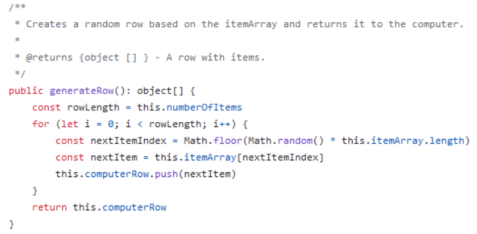

Nu ser koden istället ut så här: 
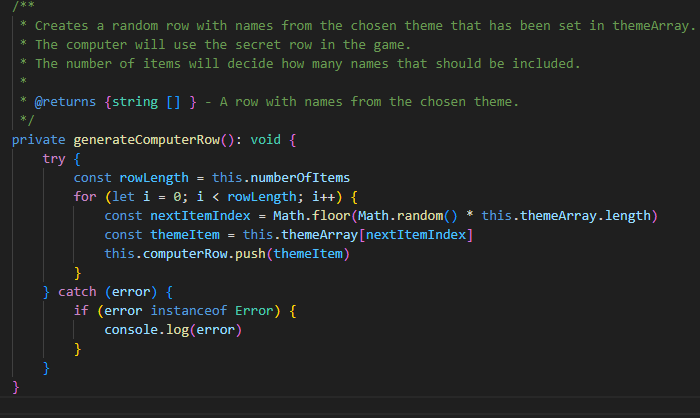

Jag har lagt in en hel del felhantering, men boken säger även att för mycket felhantering gör att koden blir ologisk och stökig, så jag har även plockat bort felhantering där jag anser att det inte behövs. 

Nedan finns ett exempel på hur min createGame-metod såg ut tidigare. Även där har jag lagt in en try -catch sats eftersom det är mycket som kan gå fel: 
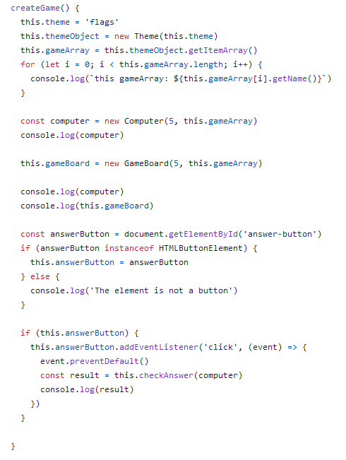

Nu ser koden istället ut så här: 
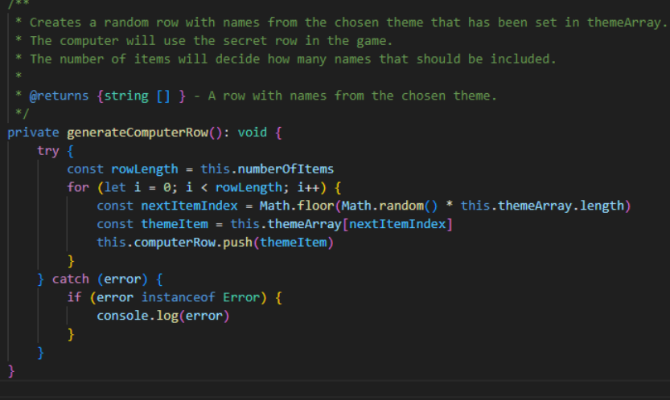

Nedan är ett exempel på en metod som jag har plockat bort i L3 eftersom det räcker att computer-Row kontrollerar att numberOfItems är korrekt eftersom den är den klassen som ska använda variabeln. 

**Kapitel 8: Bounderies**

 När jag läser kapitlet om boundaries så förstår jag mer om varför det är viktigt att skriva publika moduler på ett bra sätt, så att användaren av koden får så lite problem som möjligt. Det är en fördel om modulskrivaren kapslar in koden så mycket som möjligt för att dölja den delen av koden som användaren av koden inte har någon direkt kontakt med i sin kod. 

Om man själv använder någon annans kod så bör man testa den även om utvecklaren redan har testat den (“Exploring and learning boundaries”) . Då ser man att koden fungerar som man har tänkt sig samtidigt som man lär sig mer om modulkoden och lättare förstår hur man ska integrera den och en fördel är det är gratis att skriva tester (“Learning tests are better than free”).Om man använder någon annans kod så bör man försöka hålla den i en eller flera separata klasser med en tydlig separation mot den egna koden för att hålla “Clean boundaries".
 
I min L2 modul hade jag tidigare en publik metod som hette generateRow som en ny rad som representerar datorns hemliga rad i spelet. 
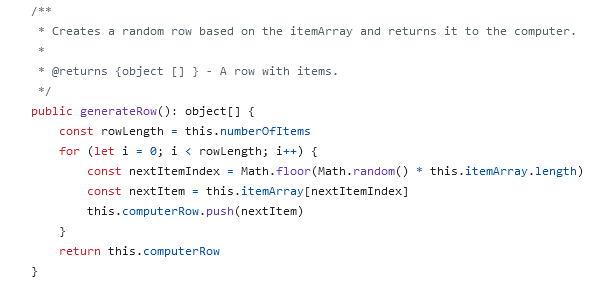 

I min L3 app har jag istället valt att göra den privat för att låta computer-row sköta skapandet själv och kapsla in metoder som inte behöver användas direkt av apputvecklarens interface. 
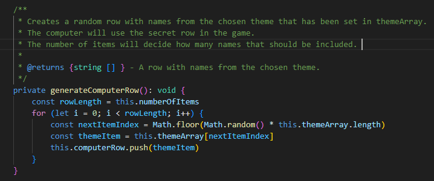

**Kapitel 9:  Unit tests**

NNär jag läser kapitlet om enhetstester så förstår jag varför vi kommer att ha en hel kurs i testning, då det är mycket att tänka på. När vi arbetade med projektet i 2dv613 så provade jag på att implementera automatiska tester, men minns att jag fick lägga ca 10 timmar på att försöka implementera automatiska tester för Vite och React, men fick tillslut ge upp testning av Reactkod pga att det var något problem med inkompatibla program. Att testa backendkod var desto lättare, men då vi snart kommer att läsa en kurs i testning så har jag valt att vänta med att testa med hjälp av ramverk utan har istället valt automatiska tester av modulen och manuella tester av appen. 

När jag har arbetat med att uppdatera L2an så har den stora nackdelen med min variant av tester varit att jag behöver och har behövt uppdatera en hel del av testerna nu när jag ska skicka in en uppdaterad version av modulen. Tester som jag tyckte var tydliga när jag skrev modulen, var inte lika tydliga när det var dags att uppdatera dem så jag förstår vikten av att hålla tester clean. Eftersom parametrar och returvärden har ändrats i flera fall så blev det många consol.log() loggningar för att se exakt vad resultatet blev i konsolen. En annan nackdel med de halvautomatiska testerna som jag skrev är att flera av dem beror på varandra så när koden ändrats så krävs det en hel del uppdateringar för att få det att fungera vilket bryter mot “Independent” i FIRST. De mindre testerna i method-testapp.ts var lätta att uppdatera, men user-testapp och ai-testapp tog desto längre tid pga att de olika metoderna är beroende av varandra. 

Exempel från ai-testapp där en automatisk körning hela spelet körs: 
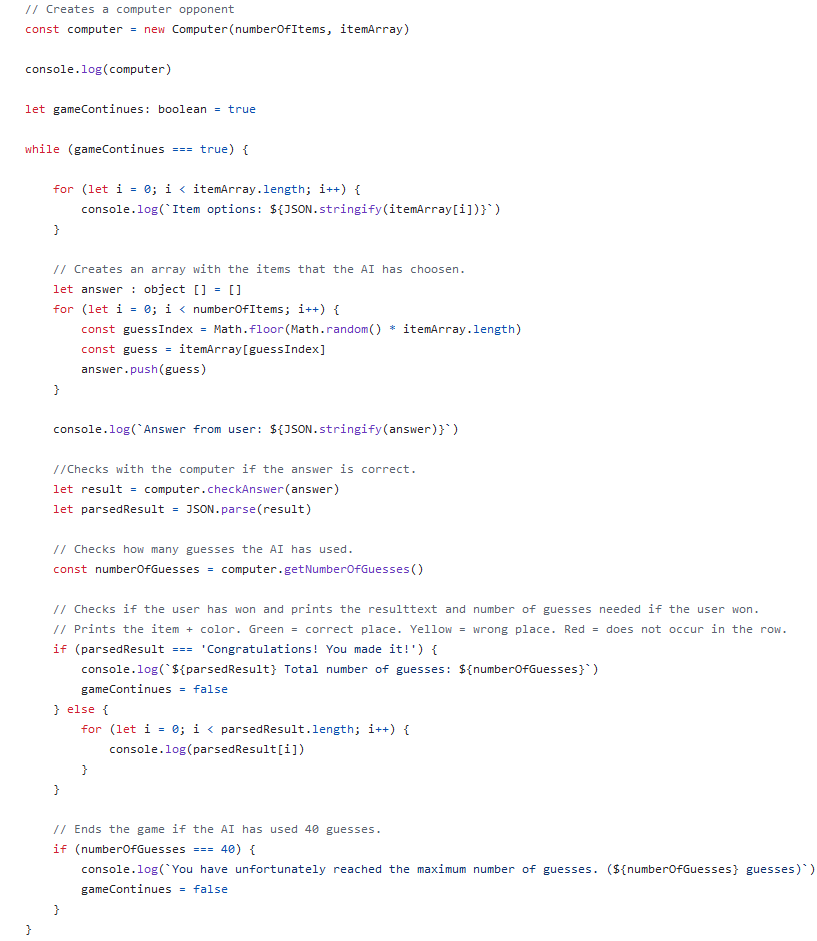 

I L3 valde jag istället manuella tester eftersom det kändes lättast för en webbapplikation. Nackdelen är att testningen tar mycket längre tid att köra då allt måste klickas manuellt jämfört med testerna för L2 som var klara på en sekund och sen tar det lång tid att skriva testspecifikation. En annan stor nackdelen är den manuella uppdateringen av testfall när man ändrar en applikation, så I testningskursen hoppas jag att vi får lära oss mer om testning för webbapplikationer.
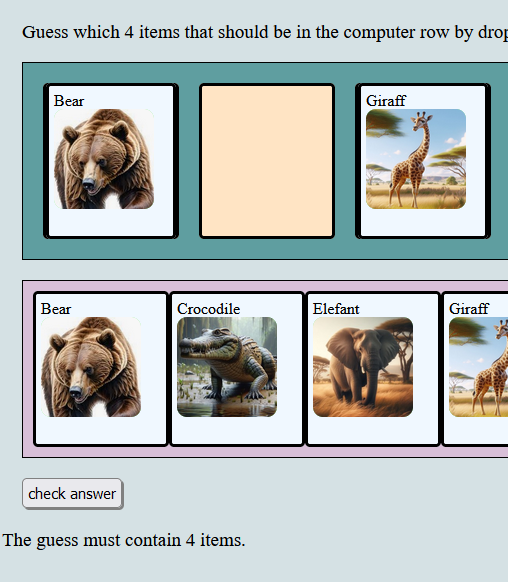 

**Kapitel 10 : Classes**

Från kapitlet tar jag med mig mycket som jag behöver tänka på. Bland annat hur viktigt det är att hålla klasserna små, fokusera på inkapsling och försöka undvika klasser som har fler än ett ansvarsområde. Jag har också fått en bättre förståelse för cohesion och att det är när cohesion mellan olika delar blir för låg eller när man får för många privata variabler eller när man använder för många parametrar i privata metoder som det är dags att börja tänka på att splittra en klass. 

L2:  
När jag arbetade med L2 var det lite lättare att hålla klasserna små än i L3 när man ska blanda element, men jag tagit en ny titt på min L2 kod och insett att jag haft en hel del onödig kod som aldrig kommer användas som jag nu har tagit bort och jag har även ändrat en del metoder som varit publika innan till att nu vara privata för att förbättra inkapslingen.   
Nedan metoder fanns med både i computer och i computer-row vilket bryter mot principen DRY \- don´t repeat yourself. När jag tog bort metoderna i computer kunde jag minska mängden kod och jag fick en privat variabel mindre att hantera. 
 

L3:   
I min app har jag förutom modulerna även klasserna Game, Gameboard och GameUi. I början hade jag bara Game, men när den växte pga för många element så skapade jag en separat Gameboardklass som ansvarar för att skapa själva spelbordet. När jag lade till möjligheter för spelaren att skriva in namn, välja tema och antal brickor så blev Game återigen för stor så därför skapade jag GameUi som ska ta in input från användaren och visa textmeddelanden. Tyvärr känner jag att det fortfarande är lite väl mycket kod i mina appklasser, men jag har inte hunnit med att skapa fler klasser eftersom jag är nybörjare på Typescript och varje ändring jag gör tar några timmar då jag får så mycket felmeddelanden om att programmet inte vet om elementen jag lägger till existerar eller inte. Totalt rör det sig om många dagars arbete som jag har lagt på att bråka med Typescript eftersom allt tar väldigt lång tid utan ChatGPTs och Copilots hjälp, men vår relation förbättras för varje dag som går och jag har börjat se fördelarna jämfört med Javascript. Nedan visar hur min Game klass såg ut innan GameUi fanns.   
  

Nu har jag bl a nedan metod i gameUi som skriver ut olika typer av meddelanden: 
  

Om jag fortsätter arbeta med min app så skulle jag vilja skapa fler klasser som hanterar olika element så att mängden kod i Game, Gameboard och GameUi kan minskas och bli mindre rörig. I 1dv025 lärde jag mig arbeta med webbkomponenter och jag gissar att det kanske finns något liknande sätt för Typescript, men pga av brist på tid och strul med Typescript så har jag inte hunnit förbättra alla delar av koden. 

**Kapitel 11: Systems**

